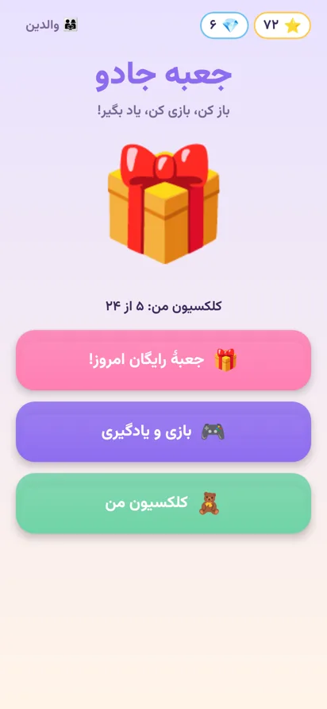
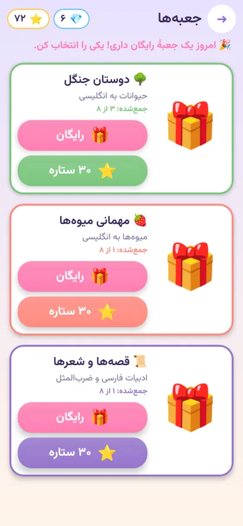
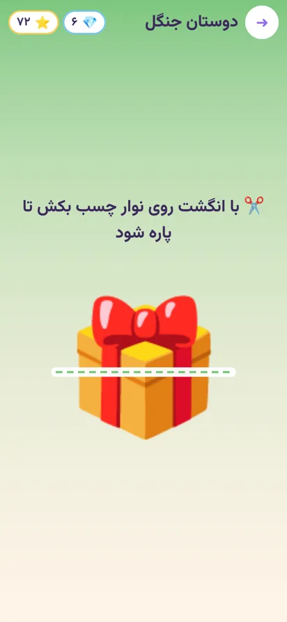
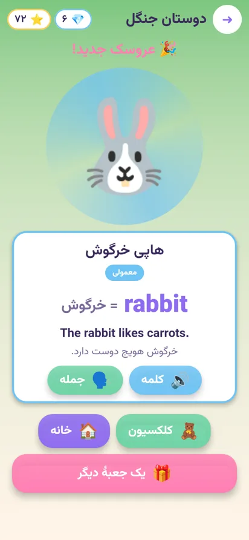
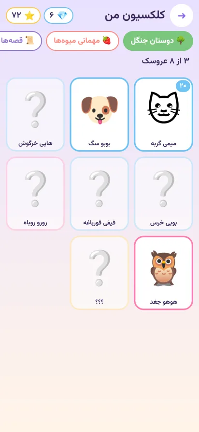
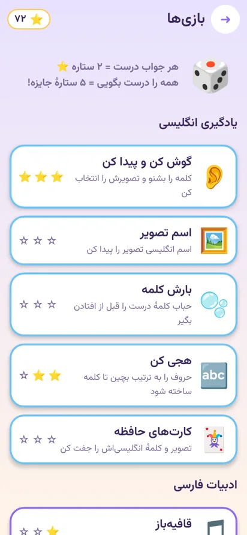
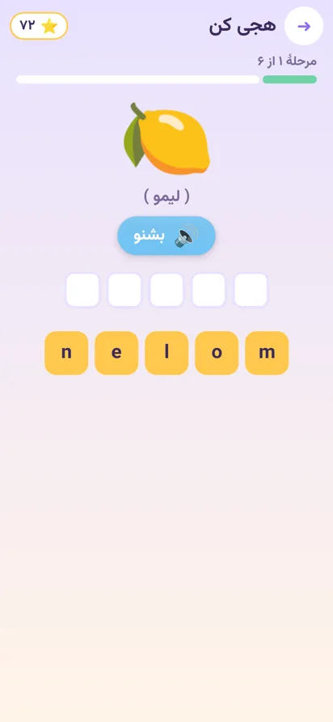
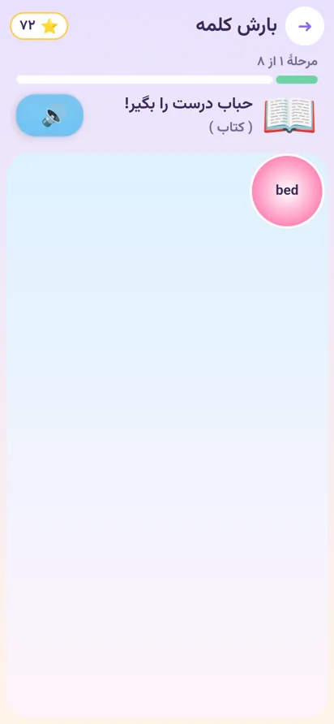
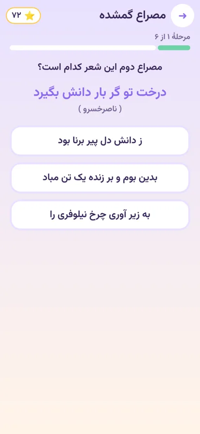
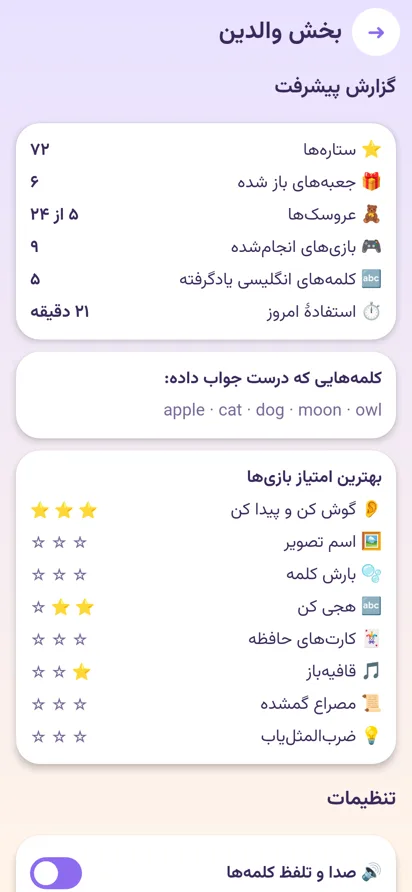

# جعبه جادو (Magic Box)

اپ اندروید آموزشی برای کودکان: جعبه‌های عروسکی کلکسیونی را باز می‌کنند و با مینی‌گیم‌ها انگلیسی و ادبیات فارسی یاد می‌گیرند. ستاره‌هایی که از بازی‌ها می‌گیرند، جعبه‌های بیشتری باز می‌کند.

An educational Android app for kids: unbox collectible "blind box" dolls, play mini-games that teach English and Persian literature, and earn stars to open more boxes.

## تصاویر صفحه‌ها

(تصاویر نسخهٔ فعلی با ایموجی موقت؛ بعد از اجرای اسکریپت نانوبنانا، عروسک‌ها و جعبه‌ها با تصاویر واقعی جایگزین می‌شوند.)

<p>
   
   
 
</p>

## امکانات

- **آنباکسینگ تعاملی:** کودک جعبه را تکان می‌دهد (۳ ضربه)، نوار چسب را با انگشت می‌بُرد و درش را باز می‌کند. عروسک با نور، کانفتی و لرزش گوشی بیرون می‌آید و خودش را به انگلیسی معرفی می‌کند.
- **۳ سری کلکسیون، هر کدام ۸ عروسک** (معمولی، کمیاب و یک عروسک مخفی):
  - 🌳 دوستان جنگل: حیوانات به انگلیسی
  - 🍓 مهمانی میوه‌ها: میوه‌ها به انگلیسی
  - 📜 قصه‌ها و شعرها: خاله سوسکه، کدو قلقله‌زن، شنگول و منگول، سیمرغ و… هر کدام با یک بیت یا ضرب‌المثل و معنی ساده‌اش
- **۸ مینی‌گیم:**
  - انگلیسی: گوش کن و پیدا کن، اسم تصویر، بارش کلمه (حباب‌های در حال افتادن)، هجی کن، کارت‌های حافظه
  - ادبیات: قافیه‌باز، مصراع گمشده (سعدی، فردوسی، مولوی، ناصرخسرو)، ضرب‌المثل‌یاب
- **اقتصاد بازی:** هر جواب درست ۲ ستاره است و جواب کامل ۵ ستارهٔ جایزه دارد. هر جعبه ۳۰ ستاره می‌خواهد و روزی یک جعبهٔ رایگان هم هست. عروسک تکراری به «تکهٔ الماس» تبدیل می‌شود و با تکه‌ها می‌شود عروسک گم‌شده را ساخت.
- **بخش والدین (با سؤال ضرب):** گزارش پیشرفت، کلمه‌های یادگرفته، محدودیت زمان روزانه با صفحهٔ «وقت استراحت»، قطع صدا و پاک کردن پیشرفت.
- **امن برای کودک:** بدون خرید درون‌برنامه‌ای، بدون تبلیغ و بدون اینترنت. همه‌چیز فقط روی گوشی ذخیره می‌شود.
- **تلفظ:** با موتور Text-to-Speech خود اندروید.
- **رابط کاملاً فارسی و راست‌به‌چپ:** با فونت وزیرمتن.

## تصاویر با نانوبنانا (Nano Banana)

همهٔ تصاویر (۲۴ عروسک، ۳ جعبه، پس‌زمینه، مسکات) با مدل تصویری Gemini ساخته می‌شوند. توضیح ظاهر هر کدام در `app/src/main/assets/content/catalog.json` است. تا وقتی تصویری ساخته نشده باشد، اپ به‌جایش ایموجی نشان می‌دهد، پس همیشه قابل اجراست.

**روش ۱: GitHub Actions (پیشنهادی)**
1. در گیت‌هاب به **Settings → Secrets and variables → Actions** بروید و یک secret به نام `GEMINI_API_KEY` بسازید (کلید را از https://aistudio.google.com/apikey بگیرید).
2. در تب **Actions** ورک‌فلوی **Generate artwork (Nano Banana)** را اجرا کنید (Run workflow).
3. تصاویر ساخته می‌شوند و خودکار روی همین برنچ commit می‌شوند.

**روش ۲: روی کامپیوتر خودتان**
```bash
pip install pillow
export GEMINI_API_KEY=...
python3 tools/generate_images.py            # فقط تصاویری که هنوز ساخته نشده‌اند
python3 tools/generate_images.py --dry-run  # فقط نمایش prompt ها
python3 tools/generate_images.py --only forest_cat --force   # ساخت دوبارهٔ یک تصویر
```
**روش ۳: ساخت دستی (مثلاً در اپ Gemini)**
همهٔ پرامپت‌ها با اسم فایل هر تصویر در [`docs/IMAGE_PROMPTS.md`](docs/IMAGE_PROMPTS.md) هستند. تصاویر را با همان اسم‌ها در یک پوشه ذخیره کنید و اجرا کنید: `python3 tools/generate_images.py --import <پوشه>`

اولین عروسک (`forest_cat`) به‌عنوان مرجع سبک به بقیه داده می‌شود تا کل کلکسیون یک‌دست باشد. پس‌زمینهٔ سفید هم خودکار شفاف می‌شود. برای مدل Nano Banana Pro، متغیر `GEMINI_IMAGE_MODEL=gemini-3-pro-image-preview` را تنظیم کنید.

## ساخت و اجرا

- Android Studio (Ladybug یا جدیدتر) و JDK 17
- `./gradlew assembleDebug`، خروجی در `app/build/outputs/apk/debug/app-debug.apk`
- `./gradlew testDebugUnitTest` برای تست‌های منطق بازی
- هر push در GitHub Actions اپ را می‌سازد و فایل APK را در بخش Artifacts می‌گذارد.

حداقل اندروید ۷ (API 24). ساخته‌شده با Kotlin، Jetpack Compose (Material 3) و Navigation Compose.

## ساختار پروژه

```
app/src/main/
  assets/content/catalog.json   ← همهٔ محتوا: عروسک‌ها، کلمه‌ها، شعرها، ضرب‌المثل‌ها، prompt تصاویر
  assets/images/                ← تصاویر ساخته‌شده با نانوبنانا (dolls/، boxes/، ui/)
  java/com/magicbox/kids/
    data/        ← مدل‌ها، قوانین بازی (GameRules)، ساخت سؤال‌ها، ذخیرهٔ پیشرفت
    audio/       ← تلفظ (TTS) و افکت صدا
    ui/screens/  ← خانه، جعبه‌ها، آنباکسینگ، کلکسیون، بازی‌ها، والدین، وقت استراحت
    ui/games/    ← مینی‌گیم‌ها
tools/generate_images.py        ← اسکریپت تولید تصویر با Gemini
```

## افزودن محتوا

برای اضافه کردن سری یا عروسک جدید فقط `catalog.json` را ویرایش کنید: یک `series` و ۸ `doll` با فیلد `look` برای توضیح ظاهر. بعد اسکریپت تصویر را اجرا کنید. کلمه‌ها، قافیه‌ها، شعرها و ضرب‌المثل‌های جدید هم خودکار وارد بازی‌ها می‌شوند.

## مجوزها

فونت وزیرمتن تحت مجوز SIL Open Font License است (`app/FONT_LICENSE_OFL.txt`). همهٔ شخصیت‌ها طراحی اختصاصی همین اپ هستند. شعرها از شاعران کلاسیک و در مالکیت عمومی‌اند.
